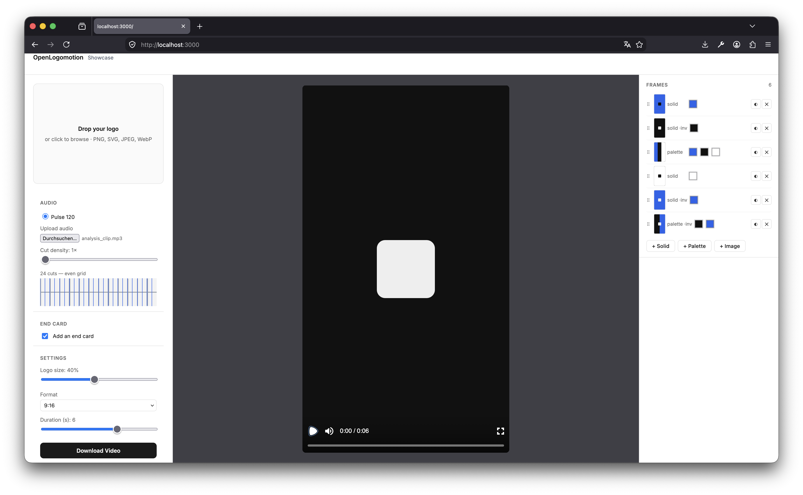

# OpenLogomotion — Showcase Match-Cut Logo Animator

An open-source recreation of the **Showcase** match-cut montage engine from [logomotion.design](https://logomotion.design).
Upload a logo, cut it over frames on the beat of your own audio, and export a vertical MP4 — **fully local**, no account, no watermark, no runtime network calls.

---

## Demo

**The editor (once started):**



**Example export:**

<video src="docs/media/showcase.mp4" controls muted playsinline width="360"></video>

▶ [Watch the example MP4](docs/media/showcase.mp4) (if the player above doesn't load inline)

---

## What it does

The logo stays **centered and fixed** while background **frames** cut behind it. Cuts fire on **audio onsets** detected in your browser from your own uploaded audio (or a bundled track), and everything loops to fill the export. Optionally the video **ends on a held "end card"** for a call-to-action.

- **Logo input** — SVG, PNG, JPEG, or WebP. The logo is always composited at the center at a configurable size (Logo-size slider). No tracing, no perspective — clean and centered.
- **Frames** (right pane) — build a montage from typed frames, each with a live 9:16 preview thumbnail:
  - **Solid** — a single hex color background.
  - **Palette** — two or more hex colors as vertical bands.
  - **Image** — drop in your own image as the background (with a **cover/contain** option in the row's `⋯` menu).
  - **Invert** any frame (`◐`) to flip the logo light↔dark so it always reads.
  - **Drag to reorder** (⠿ handle), remove (`✕`), and add via **+ Solid / + Palette / + Image**. Frames loop to fill the duration.
- **Audio + beat-matched cuts** (left pane) — pick the **bundled track** or **upload your own** (MP3/WAV/M4A/OGG…). Uploaded audio is decoded and analyzed **in the browser** (Web Audio) with transient **onset detection**; cuts land on the detected hits. No audio ever leaves your device.
  - **Sensitivity slider** — *higher = more cuts*; controls the onset threshold (relative to the strongest hit) so you can dial in how busy the montage is.
  - **Cut density (1×–4×)** — subdivides the cut grid for faster cutting.
  - **Waveform view** — a live waveform of the selected audio with **vertical markers showing exactly where the cuts land**, plus a live cut count.
- **End card / outro** (left pane, optional) — hold on a dedicated ending frame (Solid / Palette / Image, with its own invert), logo centered, for a duration you set. It **appends** to the video (montage stays full length). Great for CTAs.
- **Settings** (left pane) — Logo size, Format (9:16 / 1:1 / 16:9), Duration, and **Download Video**.
- **Live preview == export** — the Remotion `<Player>` and the server render share one composition, so the exported MP4 matches the preview exactly (the chosen audio is embedded in the output).

### Editor layout

| Pane | Contents |
|---|---|
| **Left** | Logo upload · **Audio** (bundled/upload · sensitivity · cut density · waveform+markers) · **End card** · **Settings** (logo size, format, duration) · **Download Video** |
| **Center** | 9:16 live preview + transport |
| **Right** | **Frames** list — drag-reorder, per-frame preview, add/edit Solid/Palette/Image, invert, remove |

---

## Requirements

- **Node.js 20+** and npm.
- On the **first video export**, `@remotion/renderer` downloads a headless Chromium (one-time, ~a minute, needs internet). Everything after that — including all rendering — runs locally.

## Quickstart

```bash
npm install
npm run dev
```

Open [http://localhost:3000](http://localhost:3000), upload a logo (SVG, PNG, JPEG, or WebP), build your frames, pick or upload audio, and click **Download Video**.

### Remotion Studio (optional)

```bash
npm run remotion:studio
```

---

## How rendering works

One Remotion composition — `ShowcaseComposition` (id `LogoShowcase`) — is the **single source of truth** shared by the live `<Player>` preview and the server-side `renderMedia` call. The whole animation is a pure function of the frame number:

- **Cut times** are computed once (in the editor, from onset detection or the bundled grid) and stored in the config, so preview and export cut identically.
- Frame index `< montage length` → the looping cut montage; `>=` → the held **end card** (when enabled). Total length = montage + end-card hold.

When you click **Download Video**, the browser POSTs your config JSON to `/api/render` (`app/api/render/route.ts`). The route calls `renderMedia`, passing `chromiumOptions: { gl: "angle" }` and the shared `webpackOverride` from `src/remotion/webpack-override.ts` (which wires up the `@/` path alias). Uploaded audio travels as a data URL in the config and is embedded directly into the output MP4 — no temporary server files. The MP4 is streamed back as a download.

---

## How to add a bundled track

1. Drop an `.mp3` into `public/assets/tracks/`.
2. Generate its beat grid (the generator is 120 BPM by default — edit `scripts/make-beatmap.mjs` for another tempo):
   ```bash
   node scripts/make-beatmap.mjs
   ```
3. Add an entry to `TRACKS` in `src/lib/tracks.ts`.

(Uploaded audio needs none of this — it's analyzed on the fly in the browser.)

---

## Example logo

`examples/sample-logo.svg` is a minimal two-colour filled-path SVG you can drag straight into the editor. The ingester (`src/lib/logo-ingest.ts`) uses Three.js's `SVGLoader` for SVG path validation (not for 3D) and requires **filled paths** — stroke-only / no-fill SVGs are rejected with a descriptive error.

---

## Roadmap

- **Gradient frames** — multi-stop CSS gradient backgrounds (today: Solid, Palette, and Image frames).
- **In-UI logo placement** — the logo is always centered; a drag-to-place / offset control is planned.
- **Custom fps / resolution** — fps is fixed at 30 and resolution is per aspect ratio.
- **Looping / longer bundled audio** — so montages longer than the bundled track stay in sync.

---

## Known limitations

- **Bundled audio is a CC0 placeholder** — `public/assets/tracks/pulse-120.mp3` is a procedurally generated click-track. Replace it with properly-licensed audio before any public deployment (see `public/assets/tracks/CREDITS.md`). Your **uploaded** audio has no such caveat.
- **Onset detection is energy-based / browser-side** — cut times come from a short-time RMS energy onset detector with a relative-to-peak threshold, run in the browser. Quality depends on transient clarity; very smooth/ambient audio yields few onsets (raise Sensitivity or Cut density). No server-side ML.
- **Export duration vs. bundled track length** — the bundled track is ~6 s; exports longer than it will outrun its audio/cuts. Uploaded audio drives cuts across its own length. Keep bundled exports at/under the track length until looping lands.
- **No dimension/duration clamping in `/api/render`** — fine for local use; add guards before exposing publicly.

---

## Stack

| Layer | Library |
|---|---|
| Framework | Next.js 16 (App Router) |
| UI | React 19 |
| Composition / render | Remotion 4.0.484 (`remotion`, `@remotion/player`, `@remotion/bundler`, `@remotion/renderer`) |
| Audio analysis | Web Audio API (browser) + a hand-written onset detector (`src/lib/onset-detect.ts`) |
| SVG validation | Three.js 0.185 (`SVGLoader` in logo-ingest; no 3D rendering) |
| Language | TypeScript (strict) |
| Tests | Vitest |

---

## License

MIT — see [LICENSE](./LICENSE).

Audio credits — see [public/assets/tracks/CREDITS.md](./public/assets/tracks/CREDITS.md).
